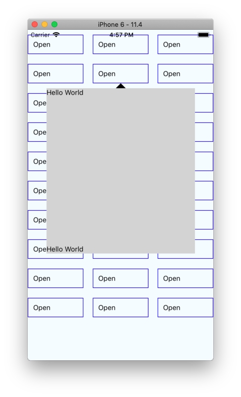
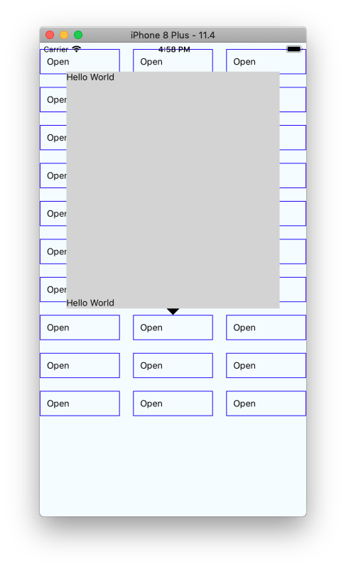

# react-native-popup

Popup control that can:
 
- [x] show above/below the trigger button
- [x] close when tapped outside the popup content
- [x] align to the center of the trigger button when possible and adjust when at window edges
- [x] adapt and adjust based on change in orientation at runtime
- [x] work with a simple API


## API and Usage

Exposes a single component `PopupButton`.

```typescript jsx
import React, { Component } from 'react';
import { StyleSheet, Text, View } from 'react-native';
import { PopupButton } from './popup';

type State = {
    visible: boolean;
    index: number;
};
const items = new Array(30).fill(0).map((x, index) => index);
console.log(items);
export default class App extends Component<{}, State> {
    public state = {
        visible: false,
        index: -1,
    };

    render() {
        return (
            <View
                style={[
                    styles.container,
                    {
                        flexDirection: 'row',
                        justifyContent: 'space-between',
                        flexWrap: 'wrap',
                    },
                ]}
            >
                {items.map(x => (
                    <PopupButton
                        key={x}
                        style={{
                            borderWidth: 1,
                            borderColor: 'blue',
                            padding: 10,
                            width: '30%',
                            marginBottom: 20,
                        }}
                        arrowColor={'black'}
                        anchor={'up'}
                        renderContent={this.renderPopupBody}
                        isOpen={this.state.visible && this.state.index === x}
                        onPress={() => this.togglePopup(x)}
                        onClose={() => this.togglePopup(x)}
                        contentStyle={{
                            width: '80%',
                            height: '50%',
                            backgroundColor: 'lightgray',
                        }}
                    >
                        <Text>Open</Text>
                    </PopupButton>
                ))}
            </View>
        );
    }

    renderPopupBody = () => {
        return (
            <View
                style={{
                    flex: 1,
                    flexDirection: 'column',
                    justifyContent: 'space-between',
                }}
            >
                <Text>Hello World</Text>
                <Text>Hello World</Text>
            </View>
        );
    };

    private togglePopup = (index: number) => {
        this.setState({ visible: !this.state.visible, index });
    };
}

const styles = StyleSheet.create({
    container: {
        flex: 1,
        justifyContent: 'center',
        alignItems: 'center',
        backgroundColor: '#F5FCFF',
    },
});
```

## Popup anchored down



## Popup anchored up


